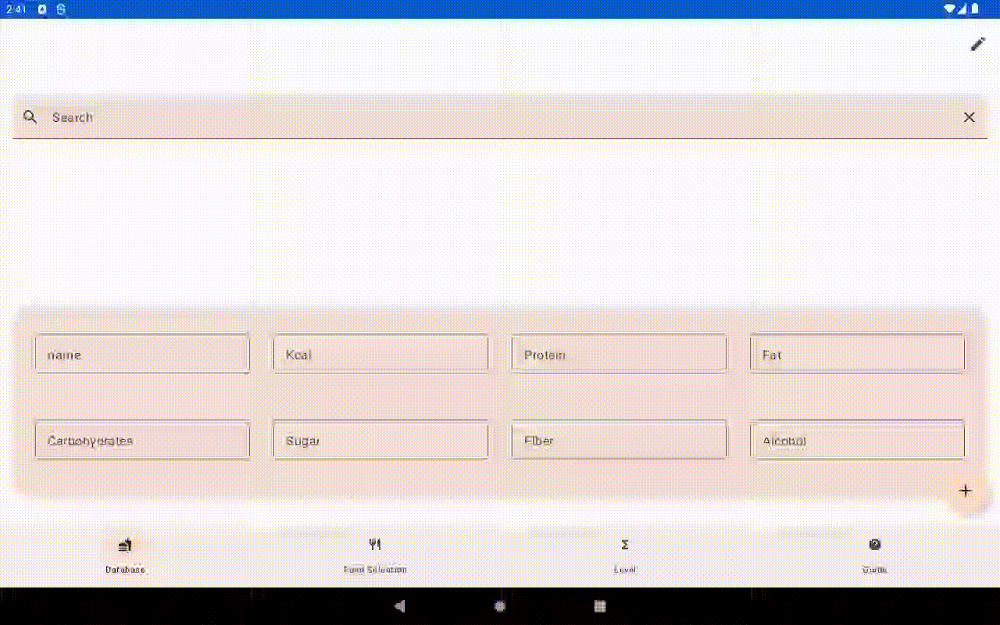
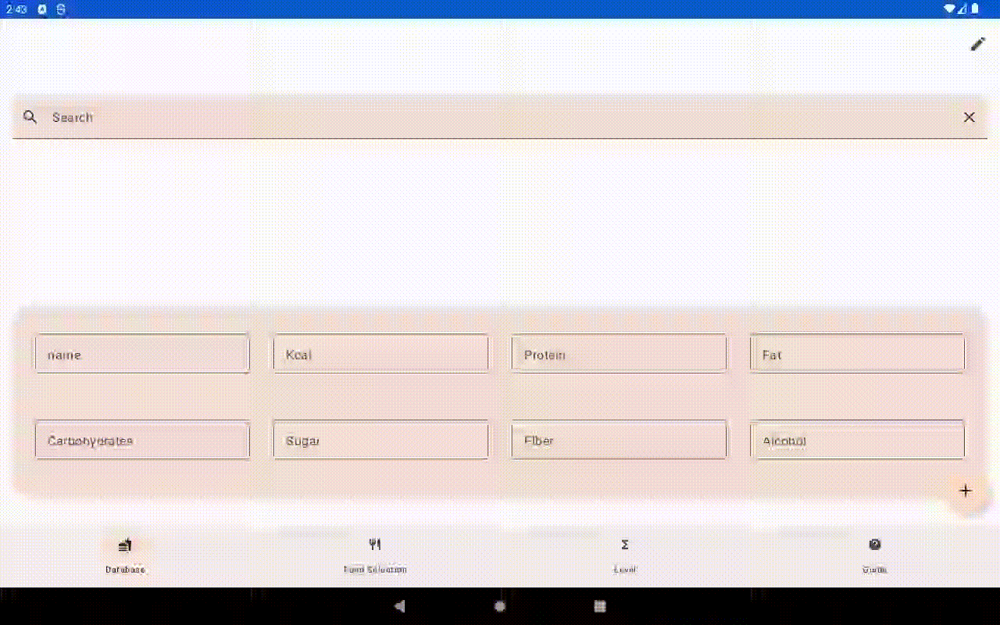
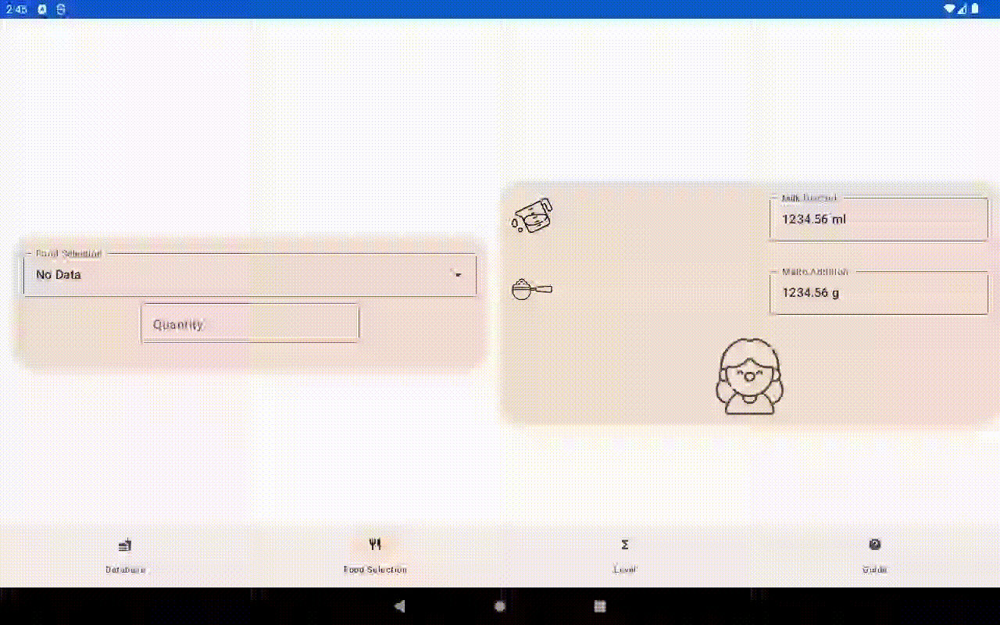

# HannApp

HannApp is an application to combine and track meals over individually selectable time ranges. It helps to follow a diet plan where particular nutrients must not exceed a limit, but reach a minimum.
The application is motivated by a friends daughter with name Hanna, whose metabolism needs to receive a precise amount of nutrients throughout the day.
HannApp is for mobile Android devices to capture the meals in a handy way without dependency to a location or a person. It just needs a mobile device and an internet connection.

The application is currently in development. Therefore some functions and UI components are not fully implemented yet. Moreover the captured application data are still bound to a single device.

# Prerequisity

Make sure you have installed the current [Gradle](https://gradle.org/install/) version

```
$ gradle -v

------------------------------------------------------------
Gradle 8.0.2
------------------------------------------------------------
```

# Installation

Use the latest [Gradle](https://gradle.org) version to build the application

`./gradlew build`

# Usage

## Search for food nutriments

Search for food with a query using the searchbar. Suggested food can be selected and be stored in the local database.



## Insert nutriments indivdually


## Modify locally stored food



## Capture a meal or daily ration

The components of a meal can be selected and logged. Based on the selection and amount, the total of the recorded nutriments will be calculated. (not implemented yet)


The application warns if the captured amount is getting close to the prescribed diet limits or exceeding.



# Run Tests

`./gradlew test`

# Credits

HannApp is fetching nutriments from a open database named [Open Food Facts](https://world.openfoodfacts.org/), whichs is a non-profit project developed by thousands of volunteers. Thanks to their enthusiasm it is possible to search and to add food in such a handy way.

# Licence

This project is licensed under the terms of the MIT license.

# Contact

[Stefan Elsner](https://github.com/StefanElsnerDev/)